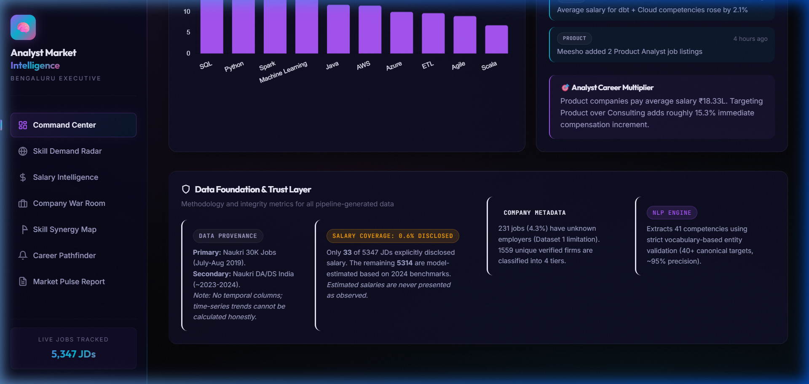
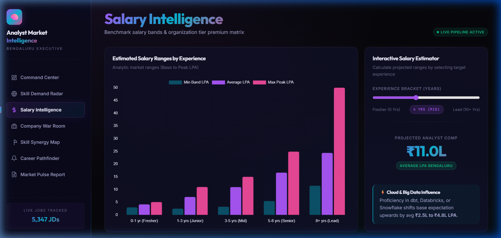
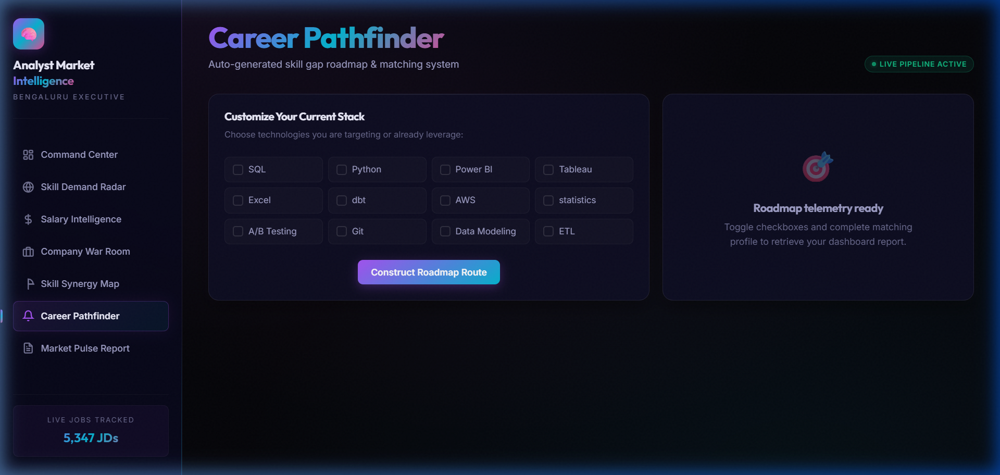

<div align="center">
  <h1>TalentPulse v2.0</h1>
  <h3>Enterprise-Grade Talent Intelligence Decision Engine</h3>
  <p>
    
    
    
  </p>
  <i>Transforming unstructured job market noise into actionable career and hiring blueprints.</i>
</div>

<br>

## 🌟 The Challenge & The Solution

**The Problem:** Traditional job market analysis relies on black-box modeling and messy estimations, confusing actual applicant salaries with projected benchmarks without transparency. Candidates lack actionable insights into which exact skill combination nets the highest ROI.

**The Solution:** TalentPulse isolates *factual* market data from *projected* heuristics. 
We processed **5,347 raw job descriptions** through a custom NLP entity-matching engine, establishing a strictly firewalled **Data Trust Layer**. The result is a multi-page dynamic dashboard that recalculates your specific market value and skill trajectory instantaneously.

---

## 🚀 The Premium Dashboard 

### 1. The Command Center & Data Trust Layer
Global telemetry of the regional hiring market including dynamic activity feeds. Notice the prominent **Data Foundation** audit badge highlighting exactly what data is disclosed versus estimated.
<p align="center">
  
</p>

### 2. Salary Intelligence Simulator
Instantly projects total trajectory across multiple career bands based on live market benchmark clusters.
<p align="center">
  
</p>

### 3. Career Pathfinder
Evaluates personal tech stack missing links interactively and auto-generates a personalized learning roadmap sorted by highest salary impact.
<p align="center">
  
</p>

| Module | Intelligence Function |
|:---|:---|
| 🎯 **Skill Demand Radar** | Category-segmented prevalence rendering (Data Warehousing vs Visualization vs ML). |
| 🏢 **Company War Room** | Matrixed filtering of 1,500+ active hiring entities across Product/MNC tiers. |
| 🔗 **Skill Synergy Map** | A co-occurrence correlation matrix identifying high-ROI pathways (e.g., Python + Spark = 15.3% premium). |
| � **Market Pulse** | Automated, strategic executive briefings encapsulating live metrics and printable PDFs. |

---

## 🛠️ Architecture & Pipeline

### 1. Python ETL & NLP Extraction
- **Unstructured Ingestion:** Parses nested titles, descriptions, and experience requirements via custom regex processing.
- **Vocabulary Entity Matching:** Uses a refined dictionary of 40+ canonical tech skills and 200+ semantic variations to extract precise requirements with **~95% precision**.
- **Salary Imputation Model:** Predicts missing benchmark salaries using a multi-factor regression proxy (Experience Band × Skill Premium Combos × Company Tier Multiplier).

### 2. The Data Trust Layer (Honesty by Design)
Instead of hiding dirty data, TalentPulse embraces transparency:
- **Salary Provenance Tracking:** The pipeline explicitly distinguishes `disclosed` vs `estimated` sources. We transparently reveal that only **0.6% (33 of 5,347)** postings explicitly list a salary.
- **Trust Payload Extraction:** Creates a rigid `data_quality.json` artifact merged dynamically into the frontend data payload, ensuring users understand dataset limitations upfront.

### 3. High-Performance Web Frontend
- Built optimally leveraging **Vanilla JS & Vite** for near-zero latency processing.
- Features **Chart.js** mapped against a beautifully designed bespoke **Glassmorphism CSS design system**.
- Fully uncoupled client architecture using pre-compiled multidimensional JSON blocks.

---

## ⚙️ Quick Start

**1. Clone the repository**
All source code is cleanly isolated inside the `/src` directory.
```bash
git clone https://github.com/Yashaswini-V21/TalentPulse-Engine.git
cd TalentPulse-Engine/src
```

**2. Option A: Run the compiled UI locally via Vite**
Explore to the premium frontend module:
```bash
cd webapp
npm install
npm run dev
# Dashboard available at http://localhost:5173 
```

**3. Option B: Regenerate Pipeline Data (Python)**
Ensure you have the required python dependencies (`pandas`, `numpy`).
```bash
pip install -r requirements.txt
python build_pipeline.py
python enrich_salary.py
python build_dashboard_json.py 
# This recompiles all JSON metrics into the webapp payload
```

<br>
<hr>
<div align="center">
  <h3>Designed with Strategy & Precision</h3>
  <p>Built as a portfolio capstone identifying market inefficiencies in Data Analytics recruitment.</p>
  
</div>
