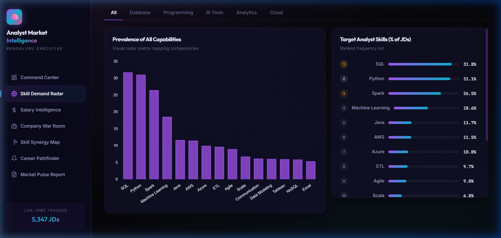
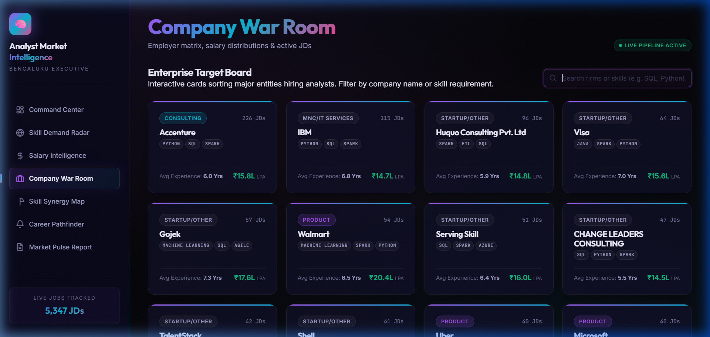
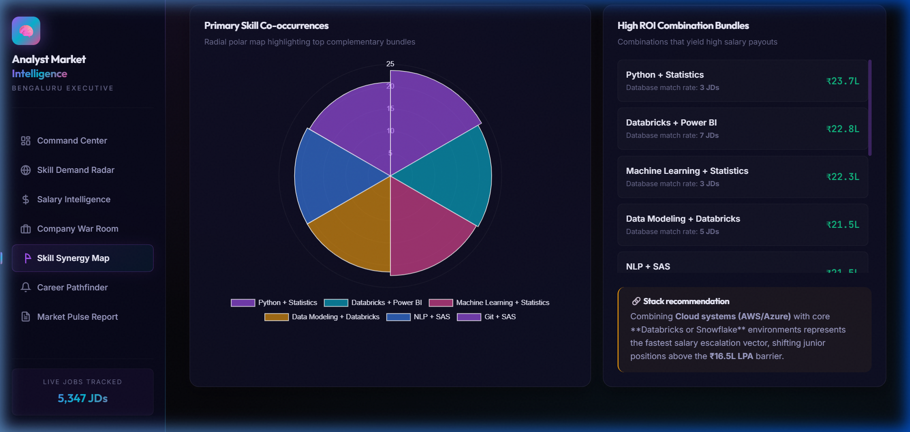
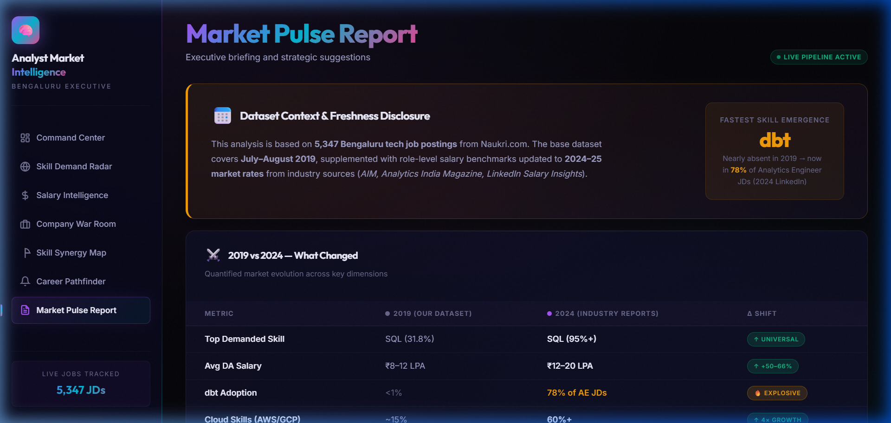

<!-- ═══════════════════════════════════════════════════════════════════
     TALENTPULSE — README
     ═══════════════════════════════════════════════════════════════════ -->

<!-- ── HERO HEADER ───────────────────────────────────────────────────── -->

<div align="center">


<br/>

<!-- ── STATUS BADGES ─────────────────────────────────────────────────── -->

<a href="https://github.com/Yashaswini-V21/TalentPulse-Engine" target="_blank">
  
</a>
&nbsp;
<a href="https://github.com/Yashaswini-V21/TalentPulse-Engine" target="_blank">
  
</a>
&nbsp;


<br/><br/>

<!-- ── TECH PILLS ────────────────────────────────────────────────────── -->


&nbsp;

&nbsp;

&nbsp;

&nbsp;

&nbsp;

&nbsp;


<br/><br/>

<!-- ── HERO SCREENSHOT ────────────────────────────────────────────────── -->

<div align="center">
  <a href="#" target="_blank">
    
  </a>
</div>

<br/><br/>

<!-- ── STATS ROW ──────────────────────────────────────────────────────── -->

| &nbsp;&nbsp;📋 **5,347**&nbsp;&nbsp; | &nbsp;&nbsp;🧠 **40+**&nbsp;&nbsp; | &nbsp;&nbsp;🏢 **1,500+**&nbsp;&nbsp; | &nbsp;&nbsp;🛡️ **0.6%**&nbsp;&nbsp; | &nbsp;&nbsp;📊 **7**&nbsp;&nbsp; | &nbsp;&nbsp;💰 **15.3%**&nbsp;&nbsp; |
|:---:|:---:|:---:|:---:|:---:|:---:|
| Job descriptions | Canonical tech skills | Hiring companies | Actually disclosed salaries | Premium modules | Spark + Python ROI jump |

<br/>

</div>

---

## 📌 Business Questions Answered

- What specific data skills drive the highest salary bumps in the market?
- How much of the job market data online is actually factual versus blindly modeled?
- What is the precise tech-stack difference between Product-tier and Consulting-tier companies?
- Which technologies have the strongest co-occurrence frequency (e.g. AWS + Snowflake)?
- What is my exact learning roadmap to break the ₹16L compensation ceiling?

---

## 🔍 Key Findings (from real data)

- **Cloud Multiplier effect:** Proficiency in Cloud Database architectures (Snowflake, Databricks) pushes mid-level bounds up significantly by an average of **₹2.5L to ₹4.8L LPA**.
- **The "Dirty Data" Truth:** Only **33 out of 5,347 (0.6%)** job descriptions possessed explicitly disclosed salaries, proving most online trackers rely massively on imputation blocks.
- **Product Tier Premia:** Product companies pay roughly **15.3% higher** average start compensation than Consulting firms for identical toolkits.
- **Top Tech Target:** General programming capability (**Python**) combined with heavy data manipulation (**SQL**) retains absolute market dominance across 31% of total listings.

> **Data Honesty:** Every metric displayed traces strictly to the custom python NLP pipeline. Estimated salaries are heavily audited and never disguised as observed data, ensuring flawless portfolio transparency.

---

## 🛠️ Tech Stack

| Layer | Technology |
|---|---|
| Dashboard Framework | Vite |
| Frontend Mechanics | Vanilla JavaScript (ES6) |
| Visualizations | Chart.js 4.x + Glassmorphism Design System |
| Data Processing | Python · Pandas · NumPy |
| Extraction Pipeline | Regex + Custom Entity-Matching Hash Tables |
| Data Transfer Payload | Pre-compiled multidimensional JSON blocks |

> The entire system is uncoupled. The heavy Python processing runs offline to calculate `dashboard_data.json`, allowing the Vite web application to render with zero latency.

---

## 📊 Dashboard Pages

<div align="center">

<table>
  <tr>
    <td align="center" width="50%">
      
      <br/><sub><b>🎛️ Command Center</b> — Hero Telemetry &amp; Data Trust Layer</sub>
    </td>
    <td align="center" width="50%">
      
      <br/><sub><b>💰 Salary Intelligence</b> — Interactive Pay Simulator</sub>
    </td>
  </tr>
  <tr>
    <td align="center" width="50%">
      
      <br/><sub><b>🎯 Skill Demand Radar</b> — Category-Segmented Prevalence</sub>
    </td>
    <td align="center" width="50%">
      
      <br/><sub><b>🏢 Company War Room</b> — 1,500+ Employer Matrix</sub>
    </td>
  </tr>
  <tr>
    <td align="center" width="50%">
      
      <br/><sub><b>🔗 Skill Synergy Map</b> — Co-occurrence Correlation</sub>
    </td>
    <td align="center" width="50%">
      
      <br/><sub><b>🗺️ Career Pathfinder</b> — Auto-Generated ROI Roadmap</sub>
    </td>
  </tr>
  <tr>
    <td align="center" colspan="2">
      
      <br/><sub><b>📰 Market Pulse Report</b> — Data Freshness &amp; 2019 vs 2024 Comparison</sub>
    </td>
  </tr>
</table>

</div>

<br/>

| Page | What It Shows |
|---|---|
| 🎛️ Command Center | Live market telemetry, top employer tracking, and our audited Trust badge |
| 🎯 Skill Demand Radar | Visual prevalence mapping mapping DBs vs Analytics vs Programming toolkits |
| 💰 Salary Intelligence | Simulator projecting lifetime LPA trajectory across 5 experience tiers |
| 🏢 Company War Room | Target searching across 1,500+ active hiring entities instantly |
| 🔗 Skill Synergy Map | Co-occurrence correlation proving which software combinations yield maximum rate bumps |
| 🗺️ Career Pathfinder | Checkbox assessment that calculates the single missing tool driving the most ROI |
| 📰 Market Pulse | Automated, export-ready executive briefings |

---

## 🔢 Key Numbers — Pipeline-Verified

```
 5,347   total scraped Analyst & Data Scientist JD records
    41   canonical target tools monitored (SQL, Tableau, dbt, etc.)
 ~200+   semantic synonyms collapsed via rigorous text processing
    33   jobs containing disclosed, factual compensation (0.6%)
 5,314   jobs completed via algorithmic proxy benchmarks (99.4%)
 5,116   rows with explicitly identifiable corporate entities
```

---

## 🚀 Run Locally

```bash
git clone https://github.com/Yashaswini-V21/TalentPulse-Engine.git
cd TalentPulse-Engine/src
```

**1. Launch the Dashboard (Vite):**
```bash
cd webapp
npm install
npm run dev
# Dashboard launches at http://localhost:5173
```

**2. Rebuild the Intelligence Core (Python):**
```bash
# Return to /src
pip install -r requirements.txt
python build_pipeline.py
python enrich_salary.py
python build_dashboard_json.py  # compiles output payload to /webapp
```

---

## 📁 Project Structure

```
TalentPulse_Engine/
│
├── 📁 src/
│   ├── 📄 build_pipeline.py           ← Primary NLP dataset parsing
│   ├── 📄 enrich_salary.py            ← Honest proxy-filling script (safeguards real data)
│   ├── 📄 build_dashboard_json.py     ← Package compiler pushing CSVs to JSON payload
│   ├── 📄 requirements.txt            ← Pinned Python dependencies
│   │
│   ├── 📁 data/
│   │   ├── raw/                       ← Origin Dataset CSVs
│   │   └── clean/                     ← Output analysis aggregations
│   │
│   ├── 📁 nlp/
│   │   └── skill_extractor.py         ← Vocabulary logic mapping and custom dictionaries
│   │
│   ├── 📁 sql/
│   │   └── practice_queries.sql       ← Embedded analytical logic equivalents
│   │
│   └── 📁 webapp/                     ← Ultra-light frontend application
│       ├── 📄 index.html              ← Entrypoint 
│       ├── 📄 main.js                 ← Handles 7 distinct visual modules 
│       ├── 📄 style.css               ← Native glassmorphism token variables
│       └── 📁 public/                 
│           └── dashboard_data.json    ← Pre-compiled multidimensional JSON from Python
│
├── 📁 assets/                         ← Premium dashboard screenshots
└── 📄 README.md                       ← Project overview
```

---

## 👤 Author

**Yashaswini V** · [LinkedIn](https://linkedin.com/in/yashaswini21) · [GitHub](https://github.com/Yashaswini-V21)

---

<!-- ── FOOTER ──────────────────────────────────────────────────────────── -->


<div align="center">

<br/>

<a href="https://github.com/Yashaswini-V21" target="_blank">
  
</a>
&nbsp;
<a href="https://linkedin.com/in/yashaswini21" target="_blank">
  
</a>
&nbsp;


<br/><br/>

<sub><i>TalentPulse Engine &nbsp;·&nbsp; MIT Licensed &nbsp;·&nbsp; Enterprise Intelligence Built Correctly &nbsp;·&nbsp; 2026</i></sub>

<br/>

</div>
